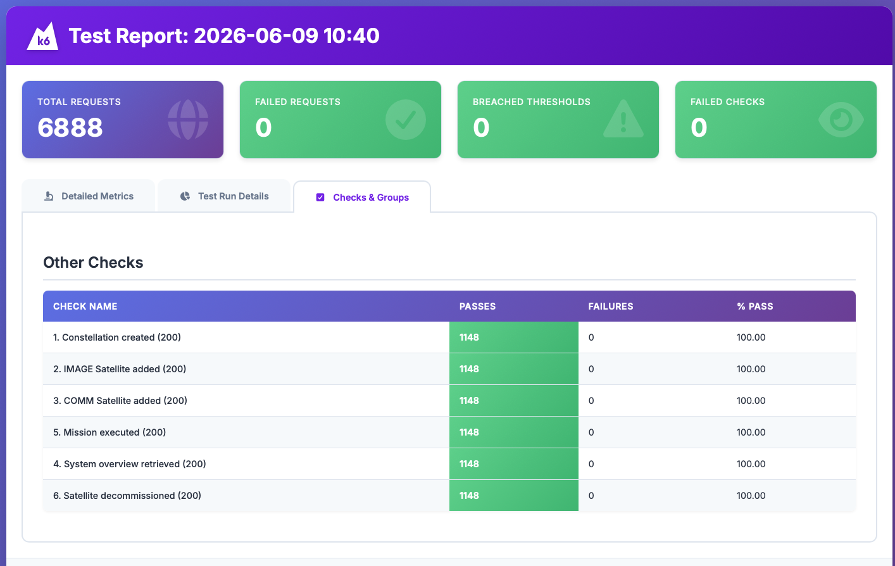

В проекте настроено профилирование производительности с помощью инструмента **k6**

### Описание сквозного пользовательского сценария
Тестовый скрипт эмулирует полноценный жизненный цикл работы диспетчера с API, опираясь на OpenAPI спецификацию:
1. `POST /api/constellations` — Регистрация новой уникальной группировки.
2. `POST /api/constellations/satellites` — Развертывание спутника типа `IMAGE`.
3. `POST /api/constellations/satellites` — Развертывание спутника типа `COMMUNICATION`.
4. `POST /api/constellations/missions` — Инициализация расчетной миссии.
5. `GET /api/constellations/{name}` — Запрос телеметрии и общего статуса группы.
6. `DELETE /api/constellations/{name}/satellites/{name}` — Удаление одного из аппаратов.

### Профиль нагрузки
* **Разгон:** от 0 до 50 параллельных пользователей за 15 секунд.
* **Удержание:** стабильная работа 50 пользователей в течение 40 секунд.
* **Спад:** плавное снижение до 0 за 10 секунд.
* **Длительность:** 65 секунд.

### Инструкция по запуску (macOS / Linux)
1. Установите k6 (для macOS: `brew install k6`).
2. Склонить репозиторий `git clone https://github.com/DmitryTamlin7/Satellites`
3. Перейти в ветку задания `git checkout k6task`
4. Запустить контейнер Docker `docker-compose up --build -d`
5. Перейдите в директорию тестов: `cd load-testing`.
6. Запустите скрипт: `k6 run load-test.js`.
7. По завершении откройте файл `report.html` в любом браузере для просмотра интерактивного отчета.

  
   
  <i>Рисунок 1. Отчет о результатах нагрузочного тестирования.</i>

